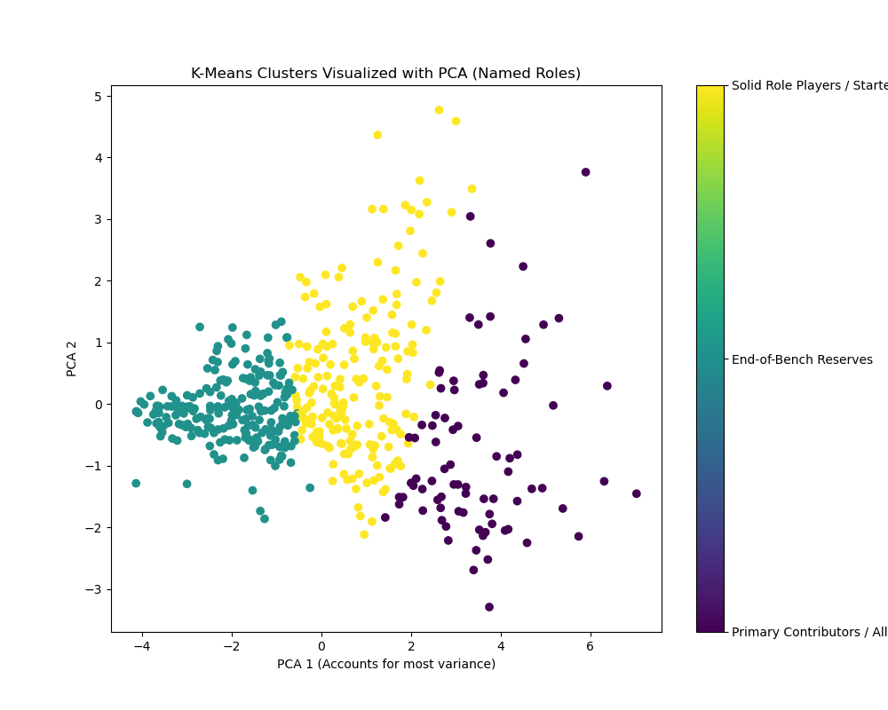
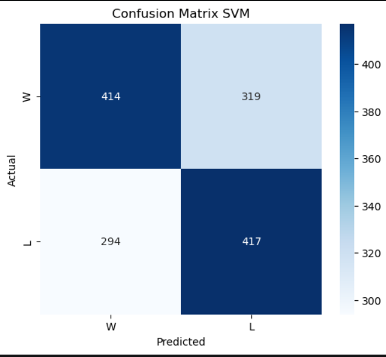

# NBA Player Performance Analysis: A Multi-Task Machine Learning Study

An end-to-end machine learning project applying supervised and unsupervised learning techniques to analyze NBA player statistics from the 2024-2025 season. The project spans regression, clustering, classification, and temporal performance tracking.

## 📊 Project Overview & Dataset
* **Core Goal:** Extract actionable basketball insights using data-driven approaches rather than traditional box-score scouting.
* **Dataset:** Evaluated game-by-game player statistics utilizing the [Kaggle NBA Player Stats & Secrets (2024-2025 Season)](https://www.kaggle.com/code/devraai/nba-player-stats-secrets-20242025-season/notebook).
* **Frameworks Used:** Python, Scikit-Learn, Pandas, NumPy, Matplotlib, Seaborn.

---

## 🛠️ Machine Learning Tasks & Pipeline

### 1. Supervised Learning: Regression (Predicting Player PTS)
* **Objective:** Predict a player's scoring output (Points) for upcoming games.
* **Models Evaluated:** Linear Regression, Random Forest Regressor, Support Vector Regressor (SVR), and Multi-Layer Perceptron (MLP) Regressor.
* **Key Finding:** Ensemble methods (Random Forest) captured complex non-linear feature interactions much better than baseline linear models when accounting for minutes played and usage rates.

### 2. Unsupervised Learning: Clustering (Identifying Playing Styles)
* **Objective:** Group players into distinct archetypes based on performance signatures, ignoring traditional positions (G/F/C).
* **Methodology:** Handled feature scaling, applied Principal Component Analysis (PCA) for dimensionality reduction, and implemented **K-Means & Agglomerative Clustering**.
* **Metrics:** Evaluated clusters using Silhouette Scores and Davies-Bouldin Index to find the optimal $K=3$ (e.g., Elite Scorers, Defensive/Rebound Specialists, Role Players).

### 3. Supervised Learning: Classification (Predicting Game Outcome)
* **Objective:** Predict whether a team wins or loses based on individual player performance impacts.
* **Models Evaluated:** Random Forest, Logistic Regression, Support Vector Machine (SVM), and Decision Tree.

---

## 📊 Classification Results Comparison (Predicting Game Win/Loss)

We trained and evaluated 4 different classifiers to predict whether a team wins or loses based on player performance metrics. Below is the performance breakdown on the Test Set:

| Model | Accuracy | Precision | Recall | F1-Score |
| :--- | :---: | :---: | :---: | :---: |
| 🌲 **Random Forest Classifier** | **71.2%** | **70.6%** | **71.2%** | **70.4%** |
| 📈 Logistic Regression | 69.5% | 69.0% | 69.5% | 69.1% |
| 🛡️ Support Vector Machine (SVM) | 68.7% | 68.1% | 68.7% | 68.1% |
| 🌿 Decision Tree Classifier | 62.3% | 62.4% | 62.3% | 62.3% |

### 🔍 Confusion Matrix Insights
* **Top Performer:** **Random Forest** achieved the highest overall accuracy (71.2%) and balanced F1-score, proving it is the most robust at handling non-linear player interactions.
* **Baseline Performance:** Logistic Regression and SVM performed closely, but struggled more with closely contested games.
* **Overfitting:** The Decision Tree showed signs of overfitting on the training data, leading to a drop in test accuracy (62.3%).

---

## 📉 Visual Results & Analytics

### Unsupervised Clustering
Below is the PCA visualization displaying the discovered natural player archetypes and clusters within the NBA dataset:

### Classification Performance (Confusion Matrices)
The confusion matrices below illustrate the true versus predicted labels for our game outcome classification models on the Test Set:

| Model | Confusion Matrix |
|---|---|
| **Random Forest** |  |
| **SVM** |  |
| **Decision Tree** |  |
| **Logistic Regression** |  |

---

## 🎯 Key Basketball Insights
* **Context Over Raw Stats:** Regression algorithms highly depend on situational factors like `Minutes Played` and match-up dependencies, which heavily skew individual baseline point predictions.
* **Modern Positionless Basketball:** Clustering confirmed that traditional positions are outdated; modern NBA players are best grouped into functional roles like "High-Volume offensive drivers" vs. "High-efficiency paint protectors."
